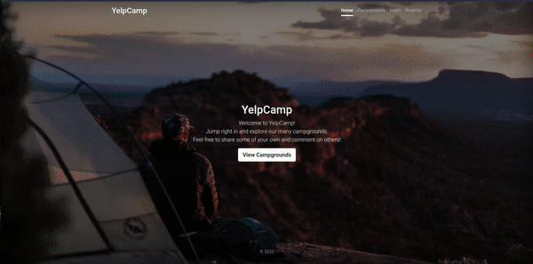

<!-- Project Title -->
# 🏕 Yelp Camp: A Campsite Review Website

<!-- Project Description -->
Yelp Camp is a full-stack web application that allows users to browse, review, and share information about campsites. Users can view campsite details, read reviews, upload images, and explore campsites on an interactive map. The project is built using the MEN stack (MongoDB, Express.js, Node.js) and integrates additional technologies like EJS, HTML, CSS, Bootstrap, Cloudinary, Mapbox, and is also a Progressive Web App (PWA).

## 🔆 Features

- Browse and search for campsites by location and name.
- View campsite details, including images, descriptions, and reviews.
- User authentication and authorization for adding and editing campsite information.
- Users can submit their own campsite reviews and ratings.
- Image upload functionality using Cloudinary for campsite images.
- Interactive map integration powered by Mapbox to visualize campsite locations.
- Progressive Web App (PWA) functionality for improved mobile experience.

## 💽 Technologies Used

- Front-end: HTML, CSS, EJS, Bootstrap
- Back-end: Node.js, Express.js
- Database: MongoDB
- Cloud Storage: Cloudinary
- Maps: Mapbox
- PWA: Service Workers, Manifest

## 🔥 Yelp Camp In Action

